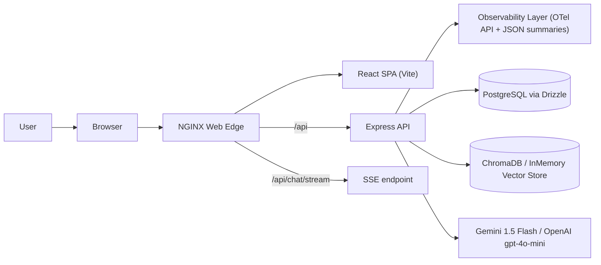
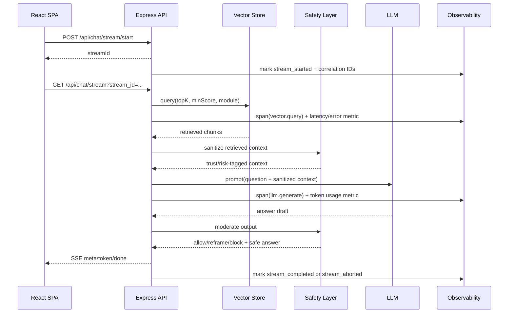
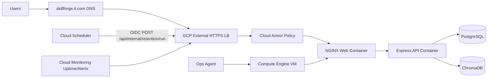

# System Architecture

This document is Markdown (`.md`) so GitHub can render Mermaid diagrams directly.

## Overview

Skill Forge is a React SPA + Express backend platform for onboarding chat, quizzes, and progress analytics.

## Chat Safety and Retrieval Flow

## Runtime Components

- Frontend: `client/src` React SPA, auth/chat/quiz/analytics UI.
- Backend: `server/src` routes, middleware, app wiring.
- Deployment runtime: Docker Compose on a remote Linux host (for example VPS or GCP Compute Engine VM) via SSH-based CI promotion.
- Data: PostgreSQL for transactional data, ChromaDB (or in-memory fallback) for retrieval.
  - Pending stream requests are persisted with TTL/expiry semantics for restart and replica safety.
- AI:
  - `services/gemini.ts` provider orchestration (Gemini -> OpenAI -> deterministic fallback).
  - `services/vectorStore.ts` retrieval and context budgeting.
  - `services/embeddings.ts` semantic embedding provider (OpenAI) with non-prod hash fallback.
  - `services/safety.ts` context sanitization and output moderation.
- Observability:
  - `services/observability.ts` central tracing/metrics helpers and periodic summary logs.
  - `services/otel.ts` exporter bootstrap/shutdown with explicit mode strategy (`none`, `console`, `otlp`).
  - `middleware/logging.ts` request metrics + correlation-enriched request logs.
  - `routes/chat.ts` stream lifecycle metrics and session/stream correlation propagation.

## Production Topology (GCP, March 2, 2026)

## Guardrails

- Reliability:
  - Async handler wrapper forwards async exceptions to centralized JSON 5xx handling.
- Cost:
  - `RAG_MAX_CONTEXT_CHARS`
  - `LLM_MAX_OUTPUT_TOKENS`
  - `LLM_TIMEOUT_MS`
- Safety:
  - Retrieved context injection sanitization + risk tagging.
  - Output moderation policy with allow/reframe/block decisions.
- Observability:
  - OTel span wrappers for provider and vector dependencies.
  - Metrics for `latency_ms`, request/error counts, `token_usage_total`, and `stream_completion_rate`.
  - Correlated request logs include `sessionId` and `streamId` where available.

## Current API Shape (Chat)

- `POST /api/chat/stream/start`
- `GET /api/chat/stream?stream_id=...`
- SSE `meta` includes context source metadata plus trust/risk tags.
- SSE `done` includes moderated answer + moderation decision metadata.

## Current API Shape (Privacy)

- `GET /api/privacy/export`
- `POST /api/privacy/retention/run`
- `DELETE /api/privacy`
- `POST /api/internal/retention/run` (scheduler automation endpoint with bearer/OIDC auth, optional edge shared-key header)
  - Production scheduler target uses HTTPS + OIDC (`https://skillforge.it.com/api/internal/retention/run`)

## Database Hot-Path Indexes

- `messages(session_id, created_at)`
- `sessions(user_id, last_active_at)`
- `quiz_attempts(user_id, started_at)`
- `quiz_questions(attempt_id, position)`
- `quiz_answers(attempt_id, answered_at)`
- `pending_stream_requests(user_id, expires_at)`
- `pending_stream_requests(expires_at)`

Versioned migration:
- `server/drizzle/0001_hot_path_indexes.sql`
- `server/drizzle/0002_pending_stream_requests.sql`

Migration apply flow:
- Versioned SQL migrations are applied by `server/scripts/migrate.ts`.
- Applied migration state is tracked in `schema_migrations`.

## Deployment Topology Notes

- CI promotion uses an SSH-based remote deploy script (`scripts/prod/deploy-remote.sh`), so the host provider is interchangeable.
- GCP Compute Engine is supported as a VM target when Docker, Docker Compose, and required ports/secrets are configured.
- Current production edge uses GCP global HTTPS load balancing with Google-managed TLS and Cloud Armor.
- Cloud Armor retention protection is a precise rule pair: strict allow (`POST` + retention path + scheduler marker header + optional shared key/CIDR allowlist) followed by explicit deny for all other retention-path traffic.
- Retention automation is scheduled in Cloud Scheduler with OIDC authentication to the internal retention endpoint.
- Monitoring setup script operationalizes logs-based API metrics, SLO burn-rate alerts, and an API dashboard for on-call triage.
