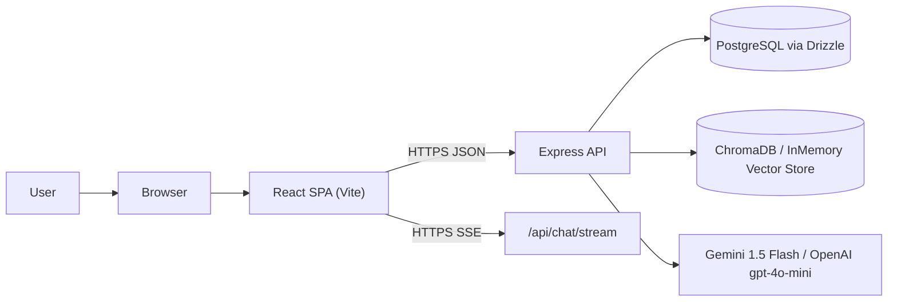
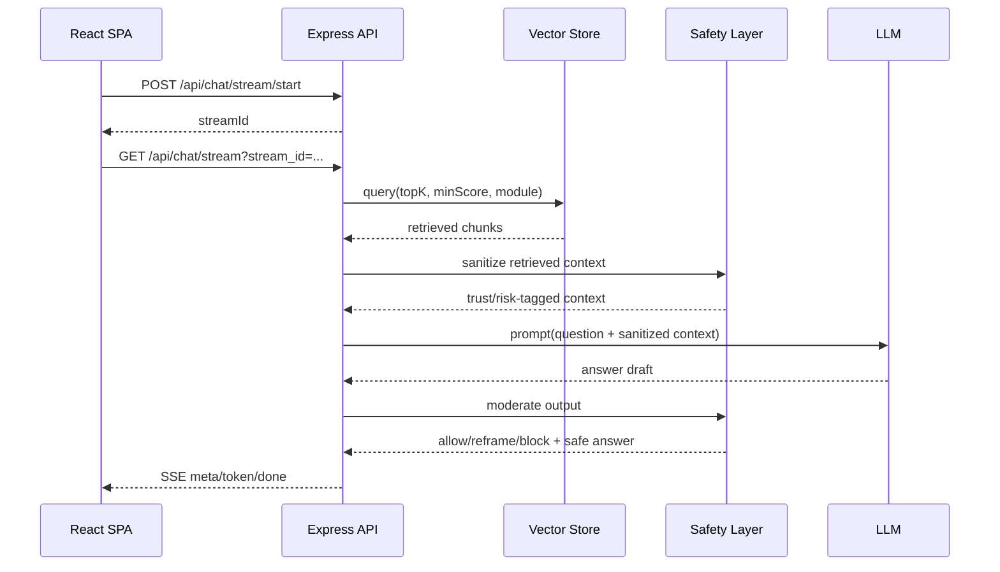

# System Architecture

This document is Markdown (`.md`) so GitHub can render Mermaid diagrams directly.

## Overview

Skill Forge is a React SPA + Express backend platform for onboarding chat, quizzes, and progress analytics.

## Chat Safety and Retrieval Flow

## Runtime Components

- Frontend: `client/src` React SPA, auth/chat/quiz/analytics UI.
- Backend: `server/src` routes, middleware, app wiring.
- Data: PostgreSQL for transactional data, ChromaDB (or in-memory fallback) for retrieval.
- AI:
  - `services/gemini.ts` provider orchestration (Gemini -> OpenAI -> deterministic fallback).
  - `services/vectorStore.ts` retrieval and context budgeting.
  - `services/safety.ts` context sanitization and output moderation.

## Guardrails

- Reliability:
  - Async handler wrapper forwards async exceptions to centralized JSON 5xx handling.
- Cost:
  - `RAG_MAX_CONTEXT_CHARS`
  - `LLM_MAX_OUTPUT_TOKENS`
  - `LLM_TIMEOUT_MS`
- Safety:
  - Retrieved context injection sanitization + risk tagging.
  - Output moderation policy with allow/reframe/block decisions.

## Current API Shape (Chat)

- `POST /api/chat/stream/start`
- `GET /api/chat/stream?stream_id=...`
- SSE `meta` includes context source metadata plus trust/risk tags.
- SSE `done` includes moderated answer + moderation decision metadata.

## Database Hot-Path Indexes

- `messages(session_id, created_at)`
- `sessions(user_id, last_active_at)`
- `quiz_attempts(user_id, started_at)`
- `quiz_questions(attempt_id, position)`
- `quiz_answers(attempt_id, answered_at)`

Versioned migration:
- `server/drizzle/0001_hot_path_indexes.sql`
