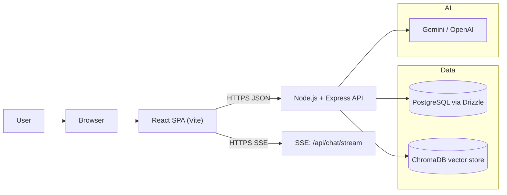
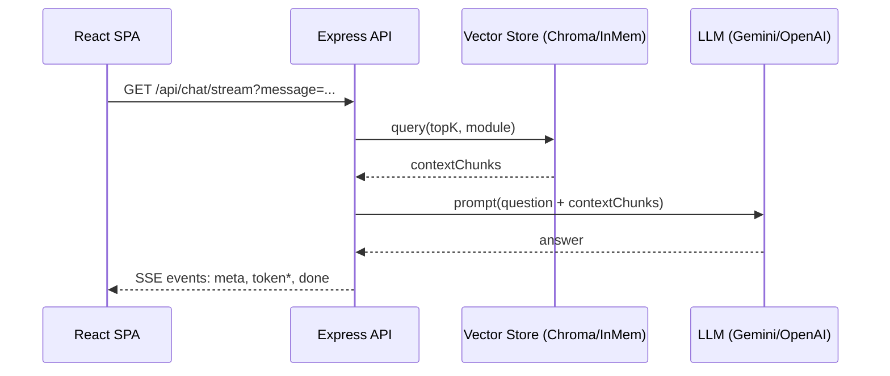

# Skill Forge: GenAI-Powered Onboarding Platform

GenAI-driven onboarding/training platform for manufacturing SMEs:
- JWT auth with secure cookie sessions
- SSE chat tutoring with retrieval context + explainability
- AI-generated quizzes and analytics dashboard
- PostgreSQL + Drizzle ORM (production) with in-memory fallback
- Optional ChromaDB integration with in-memory fallback

Example live site: `https://skillforge.it.com`

## Project Context

Originally built as part of a systems design project focused on GenAI-assisted onboarding in manufacturing SMEs.

## What The Web App Does

1. User signs up / signs in.
2. User selects a training module (for example Safety Basics, Machine Setup).
3. User asks questions in chat:
   - API retrieves relevant training chunks (ChromaDB when configured; otherwise in-memory fallback).
   - API calls the LLM (Gemini/OpenAI when configured; otherwise a deterministic fallback).
   - Response streams back to the browser over SSE (server-sent events).
4. User can generate quizzes and submit answers.
5. API records progress and analytics (Postgres when configured; otherwise in-memory fallback).

## High-Level Architecture



## Chat Request Flow (SSE)



## Stack

- Frontend: React + Vite + TypeScript + Tailwind
- Backend: Node.js + Express + TypeScript
- Database: PostgreSQL (via `DATABASE_URL`)
- Vector store: ChromaDB (via `CHROMA_URL`)
- LLM: Gemini (primary) / OpenAI (fallback)

## Local Development

1. Install dependencies:

```bash
npm install
npm --prefix server install
npm --prefix client install
```

2. Configure env:

```bash
cp .env.example .env
```

3. Run migrations (optional but recommended):

```bash
npm run migrate
```

4. Start app:

```bash
npm run dev
```

## Environment Variables

Use:
- `.env.example` for local dev
- `.env.production.example` for Docker/VPS deployments
- `client/.env.production.example` for frontend production API base (`VITE_API_BASE=/api`)

Important:
- `JWT_SECRET` (must be at least 16 chars)
- `CORS_ORIGIN`, `CLIENT_URL`
- `GEMINI_API_KEY` and/or `OPENAI_API_KEY` (optional; server has a deterministic fallback for demos)
- `DATABASE_URL` (optional; if omitted, server uses an in-memory store)
- `CHROMA_URL` (optional; if omitted/unreachable, server uses an in-memory vector store)

## API Routes

Primary (legacy-compatible):
- `POST /auth/register`
- `POST /auth/login`
- `POST /auth/logout`
- `GET /auth/me`
- `POST /chat/session`
- `GET /chat/stream`
- `POST /chat/explain`
- `POST /quiz/start`
- `POST /quiz/answer`
- `GET /me/analytics`
- `GET /health`

Also exposed under `/api/*` in production:
- `GET /api/health` includes DB + Chroma dependency checks

## Scripts

- `npm run dev` run server + client
- `npm run build` build server + client
- `npm run test` run server tests
- `npm run lint` lint server + client
- `npm run migrate` run Drizzle schema push

Docker/VPS:
- `npm run docker:prod:up`
- `npm run docker:prod:up:tls` (includes Certbot profile)
- `npm run docker:prod:up:https` (commercial cert install path)
- `npm run docker:prod:down`
- `npm run docker:prod:logs`
- `npm run smoke:auth -- https://your-domain` (signup/login/me/wrong-password smoke check)

## Deployment Notes

### VPS (Recommended)

This repo includes `docker-compose.prod.yml` plus a TLS overlay `docker-compose.https.yml`.

If your repo is on OneDrive/Windows reparse-point storage and Docker BuildKit fails, use legacy build mode:

```powershell
$env:DOCKER_BUILDKIT='0'
$env:COMPOSE_DOCKER_CLI_BUILD='0'
npm run docker:prod:up
```

### Shared Hosting (cPanel/CloudLinux)

Shared hosting typically cannot run Docker or PostgreSQL/Chroma locally. In that environment the app can run,
but persistence and retrieval are limited unless you connect to external managed services.
