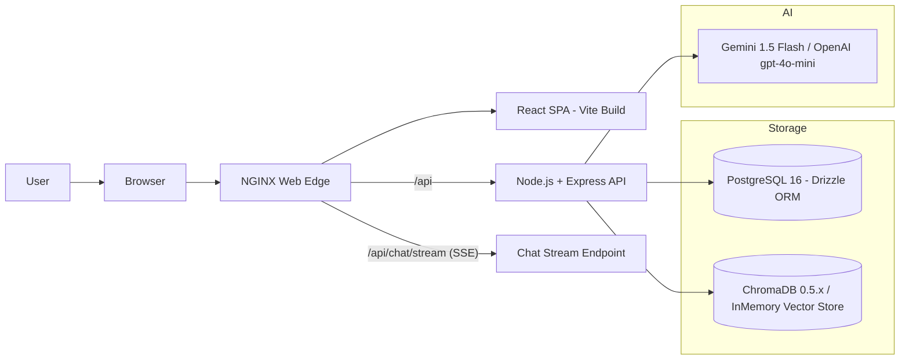
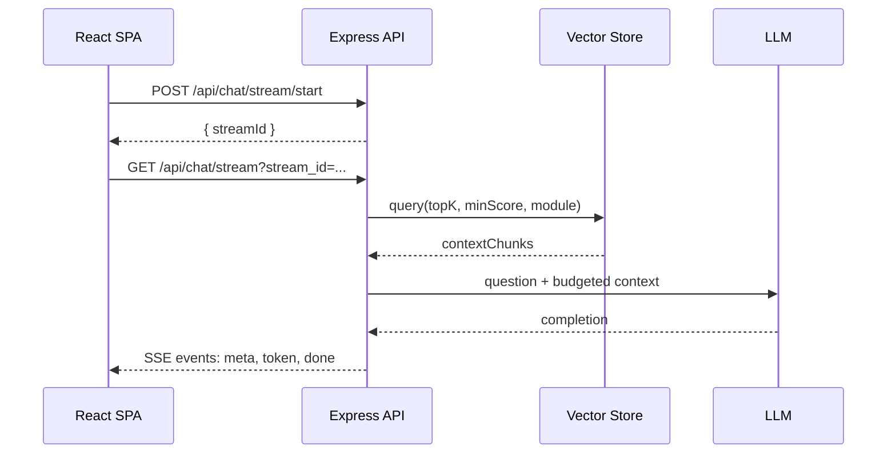

# Skill Forge: GenAI-Powered Onboarding Platform

Skill Forge is a GenAI onboarding/training webapp for manufacturing teams.

Core capabilities:
- Cookie-based auth with CSRF protection and account lockout controls
- Retrieval-augmented chat with SSE responses (`meta`, `token`, `done`)
- AI-generated quizzes, scoring, module progress, and analytics
- PostgreSQL + Drizzle ORM (production) with in-memory fallback for local/test
- ChromaDB vector retrieval (with in-memory fallback outside production)

Example live site: `https://skillforge.it.com`

Architecture doc: [`Architecture.md`](./Architecture.md)

## What The App Does

1. User signs up / signs in.
2. User starts learning in a module (for example `Safety Basics`, `Machine Setup`).
3. User asks questions in chat:
   - API stores a pending stream request.
   - API retrieves relevant context chunks.
   - API calls Gemini/OpenAI (or deterministic fallback) and streams SSE events.
4. User can start quizzes and submit answers with immediate feedback.
5. API records module progress and analytics.

## High-Level Architecture


```mermaid
flowchart LR
  U[User] --> B[Browser]
  B --> WEB[NGINX Web Edge]
  WEB --> SPA[React SPA - Vite Build]
  WEB -->|"/api"| API[Node.js + Express API]
  WEB -->|"/api/chat/stream (SSE)"| SSE["Chat Stream Endpoint"]

  subgraph Storage
    PG[(PostgreSQL 16 - Drizzle ORM)]
    VS[(ChromaDB 0.5.x / InMemory Vector Store)]
  end

  subgraph AI
    LLM[Gemini 1.5 Flash / OpenAI gpt-4o-mini]
  end

  API --> PG
  API --> VS
  API --> LLM
```

## Delivery Architecture


```mermaid
flowchart LR
  DEV[Main Branch] --> CI[GitHub Actions CI/CD]
  CI --> SEC[TruffleHog + CodeQL + Trivy]
  SEC --> BUILD[Docker Build + GHCR]
  BUILD --> STAGE[Staging Environment Approval]
  STAGE --> DEPLOY_S[Remote Deploy + Smoke Test]
  DEPLOY_S --> PROD[Production Environment Approval]
  PROD --> DEPLOY_P[Remote Deploy + Smoke Test]
  DEPLOY_P --> ROLLBACK[Auto Rollback on Smoke Failure]
```

## Chat Streaming Flow


```mermaid
sequenceDiagram
  participant SPA as React SPA
  participant API as Express API
  participant VS as Vector Store
  participant LLM as LLM

  SPA->>API: POST /api/chat/stream/start
  API-->>SPA: { streamId }
  SPA->>API: GET /api/chat/stream?stream_id=...
  API->>VS: query(topK, minScore, module)
  VS-->>API: contextChunks
  API->>LLM: question + budgeted context
  LLM-->>API: completion
  API-->>SPA: SSE events: meta, token, done
```

## PR1 Guardrails (Reliability + Cost)

Implemented in backend:
- Async error boundaries via `wrapAsync` on async handlers and middleware
- LLM request timeout via `LLM_TIMEOUT_MS`
- LLM output cap via `LLM_MAX_OUTPUT_TOKENS`
- RAG prompt context budgeting via `RAG_MAX_CONTEXT_CHARS`
- Hot-path DB indexes for chat/quiz retrieval paths

## PR2 Guardrails (AI Safety + RAG Quality)

Implemented quality and safety gates:
- Output moderation layer blocks/reframes unsafe output classes before user-visible streaming
- Retrieved context is sanitized and tagged with trust/risk metadata to resist prompt-injection patterns
- `npm run eval:rag` runs a baseline suite for:
  - retrieval top-1 accuracy checks
  - prompt-injection sanitization checks
  - moderation policy checks
- CI runs `rag-eval` in non-blocking mode initially (`continue-on-error: true`)

Current chat safety behavior:
- `meta` SSE event includes source trust/risk tags for retrieved context
- `done` SSE event includes moderation decision metadata (`allow`/`reframe`/`block`)

## PR4 Guardrails (CI/CD Security + Controlled Promotion)

Implemented CI/CD security gates and controlled promotion:
- Verified secret leak scan via TruffleHog (`--results=verified`)
- SAST via CodeQL (`javascript-typescript`)
- Container vulnerability scan via Trivy on API + web images (`HIGH,CRITICAL`)
- Environment-scoped deploy jobs (`staging` then `production`) with approvals
- Post-deploy smoke test (`scripts/auth-smoke.mjs`) and automated production rollback

## Stack

- Frontend: React 18 + Vite 6 + TypeScript 5 + Tailwind CSS
- Backend: Node.js 20 + Express 4 + TypeScript 5
- Data: PostgreSQL 16 + Drizzle ORM (current migration flow uses `drizzle-kit push`)
- Retrieval: ChromaDB 0.5.x (`CHROMA_URL`) with in-memory fallback outside production
- GenAI Providers: Gemini 1.5 Flash (primary) and OpenAI `gpt-4o-mini` (fallback)
- Containers: API on `node:20-alpine` (non-root runtime), web on `nginx:1.29-alpine`
- CI/CD: GitHub Actions with TruffleHog, CodeQL, Trivy, GHCR image publishing, staged promotion (`staging` -> `production`)

## Local Development

1. Install dependencies:

```bash
npm install
npm --prefix server install
npm --prefix client install
```

2. Configure env:

```bash
cp .env.example .env
```

3. Run migrations:

```bash
npm run migrate
```

4. Start app:

```bash
npm run dev
```

## Environment Variables

Use:
- `.env.example` for local development
- `.env.production.example` for Docker/VPS deployment
- `client/.env.production.example` for frontend API base (`VITE_API_BASE=/api`)

Important variables:
- `JWT_SECRET` (production requires strong secret, minimum 32 chars)
- `CORS_ORIGIN`, `CLIENT_URL`
- `GEMINI_API_KEY` and/or `OPENAI_API_KEY` (optional)
- `DATABASE_URL` (required in production)
- `CHROMA_URL` (required in production)
- `RAG_MAX_CONTEXT_CHARS`
- `LLM_MAX_OUTPUT_TOKENS`
- `LLM_TIMEOUT_MS`

## API Routes

Primary routes:
- `POST /auth/register`
- `POST /auth/login`
- `POST /auth/logout` (CSRF)
- `POST /auth/sessions/revoke` (CSRF)
- `GET /auth/me`
- `POST /chat/session` (CSRF)
- `POST /chat/stream/start` (CSRF)
- `GET /chat/stream?stream_id=...` (SSE)
- `POST /chat/explain` (CSRF)
- `POST /quiz/start` (CSRF)
- `POST /quiz/answer` (CSRF)
- `GET /me/analytics`
- `GET /health`
- `GET /api/health` (dependency-aware health snapshot)

All auth/chat/quiz/me routes are also mounted under `/api/*`.

## Scripts

- `npm run dev` run server + client
- `npm run build` build server + client
- `npm run test` run server tests
- `npm run lint` lint server + client
- `npm run migrate` run Drizzle `push` migration workflow
- `npm run ingest` ingest training docs
- `npm run eval:rag` run RAG eval script
- `npm run eval:rag:ci` CI wrapper for the RAG eval baseline

Docker/VPS:
- `npm run docker:prod:up`
- `npm run docker:prod:up:tls`
- `npm run docker:prod:up:https`
- `npm run docker:prod:down`
- `npm run docker:prod:logs`
- `npm run smoke:auth -- https://your-domain`

## Deployment Notes

### VPS (Recommended)

This repo includes `docker-compose.prod.yml` plus TLS overlay `docker-compose.https.yml`.

If Docker BuildKit has issues on OneDrive/Windows reparse-point paths, use legacy build mode:

```powershell
$env:DOCKER_BUILDKIT='0'
$env:COMPOSE_DOCKER_CLI_BUILD='0'
npm run docker:prod:up
```

### Shared Hosting (cPanel/CloudLinux)

Shared hosting usually cannot run Docker/Postgres/Chroma locally. The app can still run, but production persistence/retrieval requires managed external services.

## Controlled Promotion Workflow

The CI workflow supports manual promotion via `workflow_dispatch`:

1. Choose `promote_to=staging` or `promote_to=production`.
2. Set `deploy_ref` (branch/tag/SHA) to deploy.
3. `staging` deploy runs first for any production promotion.
4. `production` deploy runs only after staging passes.
5. Production smoke failure triggers automatic rollback to the previously deployed commit.

Required GitHub environment secrets (set for both `staging` and `production`):
- `SSH_HOST`
- `SSH_USER`
- `SSH_KEY`
- `DEPLOY_PATH`
- `SMOKE_BASE_URL`

Optional GitHub environment variables:
- `DEPLOY_ENV_FILE` (default `.env.production`)
- `ENABLE_HTTPS` (`true` to include `docker-compose.https.yml`)

Rollback runbook:
- [`docs/ROLLBACK_PLAYBOOK.md`](./docs/ROLLBACK_PLAYBOOK.md)
