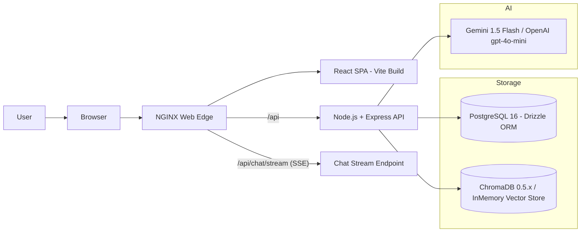
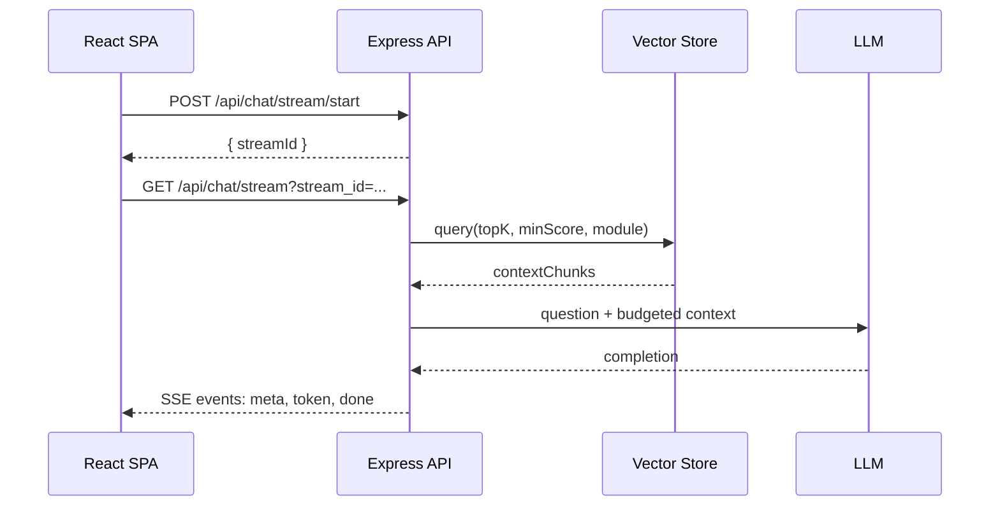

# Skill Forge: GenAI-Powered Onboarding Platform

Skill Forge is a production-ready GenAI onboarding platform for manufacturing teams, delivering guided personalized learning with real-time AI streaming, secure authentication, and resilient cloud operations.

Core capabilities:
- Cookie-based auth with CSRF protection and account lockout controls
- Retrieval-augmented chat with SSE responses (`meta`, `token`, `done`)
- AI-generated quizzes, scoring, module progress, and analytics
- PostgreSQL + Drizzle ORM (production) with in-memory fallback for local/test
- ChromaDB vector retrieval (with in-memory fallback outside production)

Example live site: `https://skillforge.it.com`

Architecture doc: [`Architecture.md`](./Architecture.md)

## What The App Does

1. User signs up / signs in.
2. User starts learning in a module (for example `Safety Basics`, `Machine Setup`).
3. User asks questions in chat:
   - API stores a pending stream request in a shared datastore with TTL expiry.
   - API retrieves relevant context chunks.
   - API calls Gemini/OpenAI (or deterministic fallback) and streams SSE events.
4. User can start quizzes and submit answers with immediate feedback.
5. API records module progress and analytics.

## High-Level Architecture


```mermaid
flowchart LR
  U[User] --> B[Browser]
  B --> WEB[NGINX Web Edge]
  WEB --> SPA[React SPA - Vite Build]
  WEB -->|"/api"| API[Node.js + Express API]
  WEB -->|"/api/chat/stream (SSE)"| SSE["Chat Stream Endpoint"]

  subgraph Storage
    PG[(PostgreSQL 16 - Drizzle ORM)]
    VS[(ChromaDB 0.5.x / InMemory Vector Store)]
  end

  subgraph AI
    LLM[Gemini 1.5 Flash / OpenAI gpt-4o-mini]
  end

  API --> PG
  API --> VS
  API --> LLM
```

## Delivery Architecture


```mermaid
flowchart LR
  DEV[Main Branch] --> CI[GitHub Actions CI/CD]
  CI --> SEC[TruffleHog + CodeQL + Trivy]
  SEC --> BUILD[Docker Build + GHCR]
  BUILD --> STAGE[Staging Environment Approval]
  STAGE --> DEPLOY_S[Remote Deploy + Smoke Test]
  DEPLOY_S --> PROD[Production Environment Approval]
  PROD --> DEPLOY_P[Remote Deploy + Smoke Test]
  DEPLOY_P --> ROLLBACK[Auto Rollback on Smoke Failure]
```

## Chat Streaming Flow


```mermaid
sequenceDiagram
  participant SPA as React SPA
  participant API as Express API
  participant VS as Vector Store
  participant LLM as LLM

  SPA->>API: POST /api/chat/stream/start
  API-->>SPA: { streamId }
  SPA->>API: GET /api/chat/stream?stream_id=...
  API->>VS: query(topK, minScore, module)
  VS-->>API: contextChunks
  API->>LLM: question + budgeted context
  LLM-->>API: completion
  API-->>SPA: SSE events: meta, token, done
```

## PR1 Guardrails (Reliability + Cost)

Implemented in backend:
- Async error boundaries via `wrapAsync` on async handlers and middleware
- LLM request timeout via `LLM_TIMEOUT_MS`
- LLM output cap via `LLM_MAX_OUTPUT_TOKENS`
- RAG prompt context budgeting via `RAG_MAX_CONTEXT_CHARS`
- Hot-path DB indexes for chat/quiz retrieval paths

## PR3 Guardrails (Resilience Policy)

Implemented resilience controls for upstream dependencies:
- Bounded retries with exponential backoff + jitter for transient provider/vector failures
- Per-dependency circuit breakers (`gemini`, `openai`, `chroma.query`, `chroma.upsert`)
- Shared policy knobs exposed via environment variables for retry and circuit settings
- Aggregated resilience telemetry logs (`resilience_summary`) plus circuit-open events (`resilience_circuit_opened`)

## PR5 Guardrails (Observability Baseline)

Implemented observability baseline across chat and dependency paths:
- OpenTelemetry spans and metrics wiring in `server/src/services/observability.ts`
- Request latency/error metrics and correlated request logs (`sessionId`, `streamId`)
- Provider/vector instrumentation for latency/error/token usage metrics
- Stream lifecycle metrics (`started`, `completed`, `aborted`) and completion-rate tracking
- Runtime exporter bootstrap with explicit strategy modes (`none`, `console`, `otlp`) and controlled OTLP endpoint/header config

## PR2 Guardrails (AI Safety + RAG Quality)

Implemented quality and safety gates:
- Output moderation layer blocks/reframes unsafe output classes before user-visible streaming
- Retrieved context is sanitized and tagged with trust/risk metadata to resist prompt-injection patterns
- `npm run eval:rag` runs a baseline suite for:
  - retrieval top-1 accuracy checks
  - prompt-injection sanitization checks
  - moderation policy checks
- CI runs `rag-eval` as a blocking gate with baseline policy thresholds

Current chat safety behavior:
- `meta` SSE event includes source trust/risk tags for retrieved context
- `done` SSE event includes moderation decision metadata (`allow`/`reframe`/`block`)

## PR4 Guardrails (CI/CD Security + Controlled Promotion)

Implemented CI/CD security gates and controlled promotion:
- Verified secret leak scan via TruffleHog (`--results=verified`)
- SAST via CodeQL (`javascript-typescript`)
- Container vulnerability scan via Trivy on API + web images (`HIGH,CRITICAL`)
- Environment-scoped deploy jobs (`staging` then `production`) with approvals
- Post-deploy smoke test (`scripts/auth-smoke.mjs`) and automated production rollback
- Auth smoke retries transient warmup errors (`502/503/504`) with configurable backoff and max-attempt knobs

## Production Readiness Snapshot (March 2, 2026)

- Readiness level: `9.3 / 10`
- Live HTTPS domain: `https://skillforge.it.com` behind a GCP global external HTTPS load balancer
- Managed certificate: Google-managed cert active for `skillforge.it.com`
- Scheduler automation: retention job runs on `https://skillforge.it.com/api/internal/retention/run` using Cloud Scheduler OIDC
- Edge protection: Cloud Armor policy enabled with a precise retention allow/deny rule pair; baseline WAF rules are currently in log-only preview mode for SQLi (priority `1000`) and XSS (priority `1100`)
- Monitoring baseline: Ops Agent active on VM, uptime checks, and CPU/memory/uptime alerts configured
- Observability operationalization: setup script can now create logs-based API metrics, SLO burn alerts, and an API overview dashboard
- CI/CD promotion status: latest successful staging -> production run was `22578711484` (March 2, 2026)
- Remaining gaps: deeper privacy governance workflows, ongoing SLO threshold calibration with production traffic, and compliance hardening evidence/runbooks

## Stack

- Frontend: React 18 + Vite 6 + TypeScript 5 + Tailwind CSS
- Backend: Node.js 20 + Express 4 + TypeScript 5
- Data: PostgreSQL 16 + Drizzle ORM with versioned SQL migrations (`server/drizzle/*.sql`) and durable pending stream request persistence
- Retrieval: ChromaDB 0.5.x (`CHROMA_URL`) with semantic OpenAI embeddings (`text-embedding-3-small` default)
- GenAI Providers: Gemini 1.5 Flash (primary) and OpenAI `gpt-4o-mini` (fallback)
- Containers: API on `node:20-alpine` (non-root runtime), web on `nginx:1.29-alpine`
- CI/CD: GitHub Actions with TruffleHog, CodeQL, Trivy, GHCR image publishing, staged promotion (`staging` -> `production`)

## Local Development

1. Install dependencies:

```bash
npm install
npm --prefix server install
npm --prefix client install
```

2. Configure env:

```bash
cp .env.example .env
```

3. Run migrations:

```bash
npm run migrate
```

4. Start app:

```bash
npm run dev
```

## Environment Variables

Use:
- `.env.example` for local development
- `.env.production.example` for Docker/VPS deployment
- `client/.env.production.example` for frontend API base (`VITE_API_BASE=/api`)

Important variables:
- `JWT_SECRET` (production requires strong secret, minimum 32 chars)
- `CORS_ORIGIN`, `CLIENT_URL`
- `GEMINI_API_KEY` and/or `OPENAI_API_KEY` (OpenAI key is recommended for semantic embeddings quality)
- `DATABASE_URL` (required in production)
- `CHROMA_URL` (required in production)
- `EMBEDDING_PROVIDER` (`auto` recommended; uses OpenAI when key is present, otherwise hash fallback)
- `OPENAI_EMBEDDING_MODEL` (default `text-embedding-3-small`)
- `EMBEDDING_BATCH_SIZE`
- `RAG_MAX_CONTEXT_CHARS`
- `LLM_MAX_OUTPUT_TOKENS`
- `LLM_TIMEOUT_MS`
- `RETRY_JITTER_RATIO`
- `LLM_RETRY_MAX_ATTEMPTS`, `LLM_RETRY_BASE_DELAY_MS`, `LLM_RETRY_MAX_DELAY_MS`
- `LLM_CIRCUIT_FAILURE_THRESHOLD`, `LLM_CIRCUIT_OPEN_MS`
- `VECTOR_RETRY_MAX_ATTEMPTS`, `VECTOR_RETRY_BASE_DELAY_MS`, `VECTOR_RETRY_MAX_DELAY_MS`
- `VECTOR_CIRCUIT_FAILURE_THRESHOLD`, `VECTOR_CIRCUIT_OPEN_MS`
- `DATA_RETENTION_DAYS`
- `OTEL_EXPORTER_MODE` (`none`, `console`, `otlp`)
- `OTEL_SERVICE_NAME`, `OTEL_SERVICE_VERSION`
- `OTEL_EXPORTER_OTLP_ENDPOINT` (shared endpoint; `/v1/traces` and `/v1/metrics` inferred)
- `OTEL_EXPORTER_OTLP_TRACES_ENDPOINT`, `OTEL_EXPORTER_OTLP_METRICS_ENDPOINT` (optional per-signal override)
- `OTEL_EXPORTER_OTLP_HEADERS` (comma-separated `key=value` pairs)
- `OTEL_METRIC_EXPORT_INTERVAL_MS`, `OTEL_METRIC_EXPORT_TIMEOUT_MS`
- `RETENTION_JOB_AUTH_TOKEN` (optional shared-token auth for `/api/internal/retention/run`)
- `RETENTION_JOB_OIDC_AUDIENCE` (recommended for Cloud Scheduler OIDC auth; should be the HTTPS endpoint URL)
- `RETENTION_JOB_ALLOWED_SERVICE_ACCOUNTS` (comma-separated allowlist for scheduler caller identities)
- `RETENTION_JOB_EDGE_SHARED_KEY` (optional additional shared-key header check for `/api/internal/retention/run`)
- `AUTH_SMOKE_RETRY_BASE_MS`, `AUTH_SMOKE_RETRY_MAX_MS`, `AUTH_SMOKE_MAX_ATTEMPTS` (auth smoke retry tuning for transient warmup failures in CI deploy checks)

## API Routes

Primary routes:
- `POST /auth/register`
- `POST /auth/login`
- `POST /auth/logout` (CSRF)
- `POST /auth/sessions/revoke` (CSRF)
- `GET /auth/me`
- `POST /chat/session` (CSRF)
- `POST /chat/stream/start` (CSRF)
- `GET /chat/stream?stream_id=...` (SSE)
- `POST /chat/explain` (CSRF)
- `POST /quiz/start` (CSRF)
- `POST /quiz/answer` (CSRF)
- `GET /me/analytics`
- `GET /privacy/export`
- `POST /privacy/retention/run` (CSRF)
- `DELETE /privacy` (CSRF)
- `POST /internal/retention/run` (bearer token or OIDC, for scheduler/automation)
- `GET /health`
- `GET /api/health` (dependency-aware health snapshot)

All auth/chat/quiz/me/privacy routes are also mounted under `/api/*`.

## Scripts

- `npm run dev` run server + client
- `npm run build` build server + client
- `npm run test` run server tests
- `npm run lint` lint server + client
- `npm run migrate` apply versioned SQL migrations from `server/drizzle`
- `npm --prefix server run migrate:status` show applied vs pending migrations
- `npm run ingest` ingest training docs
- `npm run eval:rag` run RAG eval script
- `npm run eval:rag:ci` CI wrapper for the RAG eval baseline
- `npm run retention` run retention purge workflow
- `bash scripts/prod/gcp/install-ops-agent.sh <instance> <zone>` install/configure Ops Agent on a GCE VM
- `bash scripts/prod/gcp/setup-monitoring.sh <host> <instance> <zone> [notification-channel-ids]` create uptime, VM alerts, logs-based API request metrics, SLO-burn alerts, and an API overview dashboard
- `bash scripts/prod/gcp/setup-retention-scheduler.sh <job-name> <service-url> [location] [schedule] [time-zone] [days] [service-account]` create/update scheduler retention job (OIDC requires `https://` target; injects edge marker header and optional shared-key header)
- `WAF_MODE=enforce|preview bash scripts/prod/gcp/setup-https-lb-cloud-armor.sh <instance> <zone> <domain> [prefix] [target-tag]` provision HTTPS LB + managed cert + Cloud Armor (includes precise retention endpoint allow/deny rules and baseline WAF mode upsert)

Docker/VPS:
- `npm run docker:prod:up`
- `npm run docker:prod:up:tls`
- `npm run docker:prod:up:https`
- `npm run docker:prod:down`
- `npm run docker:prod:logs`
- `npm run smoke:auth -- https://your-domain`

## Deployment Notes

### VPS (Recommended)

This repo includes `docker-compose.prod.yml` plus TLS overlay `docker-compose.https.yml`.
The remote deployment workflow is SSH-based and host-agnostic, so it works with common Linux VM targets including GCP Compute Engine.

If Docker BuildKit has issues on OneDrive/Windows reparse-point paths, use legacy build mode:

```powershell
$env:DOCKER_BUILDKIT='0'
$env:COMPOSE_DOCKER_CLI_BUILD='0'
npm run docker:prod:up
```

### GCP Compute Engine (VM)

This project can be deployed to a GCP Compute Engine VM using the same workflow:
- Provision a Linux VM with Docker + Docker Compose and clone this repo on the VM.
- Set GitHub environment secrets (`SSH_HOST`, `SSH_USER`, `SSH_KEY`, `DEPLOY_PATH`, `SMOKE_BASE_URL`) to target that VM.
- Ensure firewall rules allow `80/443` (and SSH `22` from your admin/runner paths).
- Use the existing `workflow_dispatch` promotion flow (`staging` -> `production`).
- Keep production secrets in GitHub environments or a secret manager; avoid long-lived local `.env.production` storage.

Operational hardening helpers (optional but recommended):
- Ops/Monitoring: install and configure Ops Agent, then create uptime + CPU/memory alert policies via `scripts/prod/gcp/install-ops-agent.sh` and `scripts/prod/gcp/setup-monitoring.sh`.
- Scheduled retention automation: expose `/api/internal/retention/run` with OIDC audience config and create a Cloud Scheduler job using `scripts/prod/gcp/setup-retention-scheduler.sh` against the HTTPS domain URL.
- Edge security and TLS: provision global external HTTPS LB, Google-managed certificate, and Cloud Armor baseline policy via `scripts/prod/gcp/setup-https-lb-cloud-armor.sh`.
  - Use `WAF_MODE=preview` while tuning false positives, then return to `WAF_MODE=enforce` once rules are validated.
Retention endpoint edge hardening knobs:
- `RETENTION_JOB_EDGE_HEADER_NAME` / `RETENTION_JOB_EDGE_HEADER_VALUE` (scheduler marker header, defaults to `X-Skillforge-Internal-Job=retention`)
- `RETENTION_JOB_EDGE_SHARED_KEY_HEADER_NAME` / `RETENTION_JOB_EDGE_SHARED_KEY` (optional shared-key header for stricter edge filtering)
- `RETENTION_JOB_ALLOWED_SOURCE_RANGES` (optional comma-separated CIDR allowlist included in Cloud Armor allow expression)
Observability tuning knobs (for `setup-monitoring.sh`):
- `API_SLO_TARGET`
- `API_SLO_FAST_BURN_ERROR_RATIO`, `API_SLO_FAST_BURN_WINDOW`
- `API_SLO_SLOW_BURN_ERROR_RATIO`, `API_SLO_SLOW_BURN_WINDOW`
- `API_SLO_LATENCY_P95_MS`, `API_SLO_LATENCY_WINDOW`
- `VM_CPU_ALERT_THRESHOLD`, `VM_CPU_ALERT_DURATION`
- `VM_MEMORY_ALERT_THRESHOLD`, `VM_MEMORY_ALERT_DURATION`

### Recommended Resilience Overrides (Production)

Use this minimal baseline first, then tune from `resilience_summary` and `resilience_circuit_opened` logs:

```env
RETRY_JITTER_RATIO=0.20
LLM_RETRY_MAX_ATTEMPTS=3
LLM_RETRY_BASE_DELAY_MS=300
LLM_RETRY_MAX_DELAY_MS=2500
LLM_CIRCUIT_FAILURE_THRESHOLD=6
LLM_CIRCUIT_OPEN_MS=45000
VECTOR_RETRY_MAX_ATTEMPTS=3
VECTOR_RETRY_BASE_DELAY_MS=200
VECTOR_RETRY_MAX_DELAY_MS=1500
VECTOR_CIRCUIT_FAILURE_THRESHOLD=6
VECTOR_CIRCUIT_OPEN_MS=30000
```

Tuning guidance:
- If `shortCircuits` is high but upstream errors are brief, increase `*_CIRCUIT_FAILURE_THRESHOLD` or reduce `*_CIRCUIT_OPEN_MS`.
- If `failures` and `retries` are both high with low recovery, reduce retry aggressiveness and investigate upstream saturation.

### Shared Hosting (cPanel/CloudLinux)

Shared hosting usually cannot run Docker/Postgres/Chroma locally. The app can still run, but production persistence/retrieval requires managed external services.

## Controlled Promotion Workflow

The CI workflow supports manual promotion via `workflow_dispatch`:

1. Choose `promote_to=staging` or `promote_to=production`.
2. Set `deploy_ref` (branch/tag/SHA) to deploy.
3. `staging` deploy runs first for any production promotion.
4. `production` deploy runs only after staging passes.
5. Production smoke failure triggers automatic rollback to the previously deployed commit.

The same flow applies whether the target host is a generic VPS or a GCP Compute Engine VM, as long as SSH access and Docker prerequisites are satisfied.

Required GitHub environment secrets (set for both `staging` and `production`):
- `SSH_HOST`
- `SSH_USER`
- `SSH_KEY`
- `DEPLOY_PATH`
- `SMOKE_BASE_URL`

Optional GitHub environment variables:
- `DEPLOY_ENV_FILE` (default `.env.production`)
- `ENABLE_HTTPS` (`true` to include `docker-compose.https.yml`)

Rollback runbook:
- [`docs/ROLLBACK_PLAYBOOK.md`](./docs/ROLLBACK_PLAYBOOK.md)

Observability runbook:
- [`docs/OBSERVABILITY_RUNBOOK.md`](./docs/OBSERVABILITY_RUNBOOK.md)
